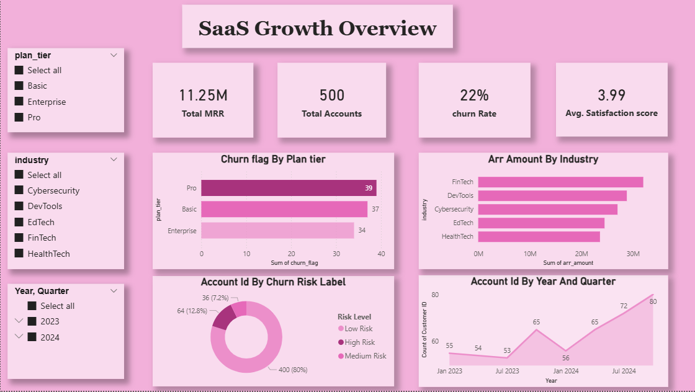
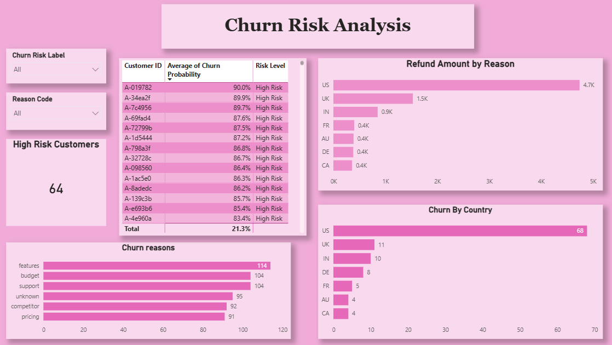
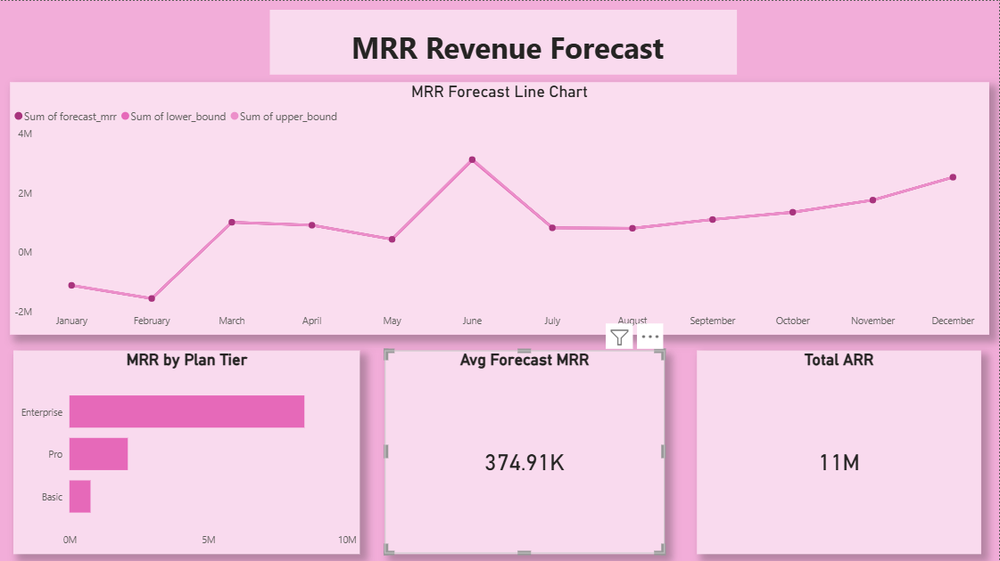

#  SaaS Growth Intelligence Platform

[Dashboard](assets)

A full-stack data analytics project that predicts customer churn and forecasts SaaS revenue using machine learning and Power BI.

👉 Built to simulate real-world SaaS business decision-making and executive reporting.

---

##  Project Overview

This project analyzes **RavenStack**, a fictional SaaS startup, using multiple datasets including:

* Customer accounts
* Subscriptions
* Feature usage
* Support tickets
* Churn events

### 🎯 Objectives:

* Identify key drivers of customer churn
* Predict high-risk customers using machine learning
* Forecast Monthly Recurring Revenue (MRR)
* Deliver insights through an executive Power BI dashboard

---

##  Architecture

```id="w7b4fj"
Raw CSV Data
    ↓
Python ETL Pipeline (Pandas + SQLAlchemy)
    ↓
SQLite Database
    ↓
Machine Learning Models (XGBoost + Prophet)
    ↓
Power BI Dashboard
```

---

##  Project Structure

```id="6l2pj9"
SaaS-Growth-Intelligence-Platform/
│
├── notebook/
│   ├── 01_etl_cleaning.ipynb
│   ├── 02_churn_model.ipynb
│   ├── 03_mrr_forecast.ipynb
│   └── 04_export_for_powerbi.ipynb
│
├── data_set/
│   ├── accounts.csv
│   ├── subscriptions.csv
│   ├── churn_events.csv
│   ├── feature_usage.csv
│   ├── support_tickets.csv
│   ├── churn_scores.csv
│   └── mrr_forecast.csv
│
├── powerbi/
│   └── SaaS Growth Intelligence.pbix
│
├── assets/
│   ├── page1_overview.png
│   ├── page2_churn_risk.png
│   └── page3_forecast.png
│
├── requirements.txt
├── .gitignore
└── README.md
```

---

##  How to Run

1. Clone the repository

```id="a6hdvt"
git clone https://github.com/Saurabh-Yadav-2005/SaaS-Growth-Intelligence-Platform
```

2. Install dependencies

```id="5g4b6z"
pip install -r requirements.txt
```

3. Run notebooks in order:

* 01_etl_cleaning.ipynb
* 02_churn_model.ipynb
* 03_mrr_forecast.ipynb
* 04_export_for_powerbi.ipynb

4. Open Power BI dashboard:

```id="k5uxeq"
powerbi/SaaS Growth Intelligence.pbix
```

---

## Dashboard Preview





---

## 🔍 Key Features

* End-to-end ETL pipeline for SaaS data
* Churn prediction using XGBoost (ROC-AUC: 0.82)
* Feature engineering across multiple datasets
* Revenue forecasting using Facebook Prophet
* Interactive Power BI dashboard for business insights

---

##  Machine Learning

### Churn Prediction

* Model: XGBoost Classifier
* Features: 19 engineered features
* Performance: ROC-AUC = 0.82

### Revenue Forecasting

* Model: Facebook Prophet
* Forecast Horizon: 6 months
* Seasonality: Yearly

---

##  Business Impact

* Identifies high-risk customers before churn
* Enables proactive retention strategies
* Improves revenue planning with forecasting
* Provides executive-level insights for decision-making

---

##  Key Insights

* Basic plan customers have the highest churn rate
* Pricing is the most common churn reason
* High support ticket escalation increases churn risk
* Revenue shows steady projected growth

---

##  Key Learnings

* End-to-end data pipeline design
* Feature engineering across relational datasets
* Machine learning model building and evaluation
* Translating data into actionable business insights

---

##  Tech Stack

| Category         | Tools                 |
| ---------------- | --------------------- |
| Data Processing  | Python, Pandas, NumPy |
| Database         | SQLite, SQLAlchemy    |
| Machine Learning | XGBoost, Scikit-learn |
| Forecasting      | Facebook Prophet      |
| Visualization    | Power BI, Matplotlib  |
| Environment      | Jupyter Notebook      |
| Version Control  | Git, GitHub           |

---

##  Dataset

Dataset: RavenStack Synthetic SaaS Dataset
Source: https://www.kaggle.com/datasets/rivalytics/saas-subscription-and-churn-analytics-dataset

---

##  Author

**Saurabh Yadav**
Aspiring Data Analyst | Python | SQL | Power BI | Machine Learning
